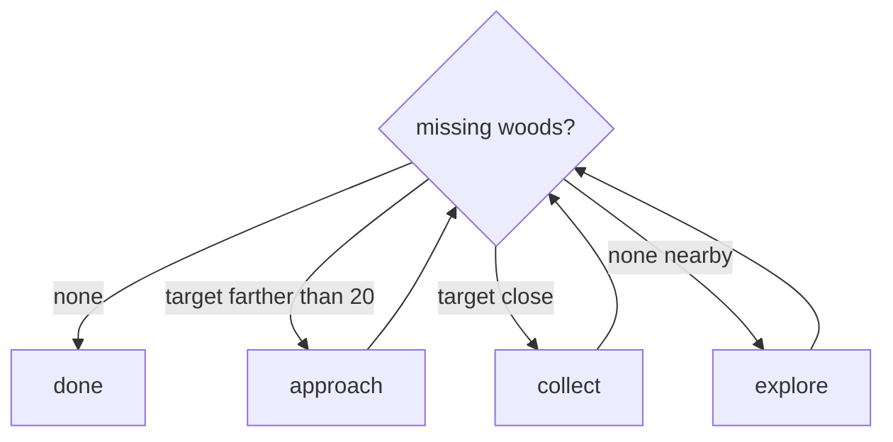

# Wood Collector Bot

A Minecraft bot whose purpose is to find and collect every type of wood in the overworld.

I made this to get a hang of game logic fundamentals and scripting using mineflayer.

## Abstract

- Problem: nine overworld log types spawn in different biomes. Chopping the oak next to spawn does not finish the job.
- Approach: a checklist loop. Missing woods → approach if the log is far, collect if it is close, otherwise hop-explore. Repeat until the list is empty.
- What broke: pathfinder “success” while jammed in a corner; walking 100 blocks into water; retargeting the same tree; staring at a log instead of mining it.
- Current status: [`bot.js`](bot.js) is the body (connect, walk, mine, chat `go`). [`brain.js`](brain.js) is the brain: checklist, approach vs collect, hops, oscillation abort, tree blacklist, hole-escape. `node bot.js` loads both.

## Problem

The goal is one log of each of nine types: oak, spruce, birch, jungle, acacia, dark oak, mangrove, cherry, pale oak. No nether stems.

- Why a farm bot is the wrong design: a farm sits in a fence, waits, and replants. I need the bot to leave after each type and find a new biome.
- Constraint — Mineflayer is a fake player, not an omniscient agent: it sees loaded chunks, walks with pathfinder, and dies in survival. It does not get a map of every tree.
- Constraint — local Paper server: Java 1.21.11 on `localhost:25565`. I watch from TLauncher. The bot is survival, op’d once so it can `/give` itself an axe.

## System

[`bot.js`](bot.js) is the body: connect, walk, mine, chat. [`brain.js`](brain.js) is the brain: what to do next.



Each loop tick also asks `mapLocal` if it is in a 1-block pit, and `path_update` aborts if `isOscillating` trips.

Constants worth naming:

- Trail length: 20 last positions (LIFO backtrack when a hop fails)
- Explore hops: 12–20 blocks, eight scored landings, snapped to standable ground
- Blacklist box: ±3 X/Z, ±6 Y around a failed or finished tree
- Other: search 64 blocks, up to 10 candidates; `nextAction` treats distance >20 as approach, not collect

## Iteration log

### Attempt 1: random 100-block wander

- Seen: no matching log nearby, so pick a random angle and `GoalXZ` 100 blocks out. Pathfinder aborted over water and cliffs; the bot froze until the next loop.
- Hypothesis: a far XZ goal is a destination, not a plan. Terrain in between is the actual problem.
- Change: shorter explore targets, then a queue of them instead of one giant leap.
- Result: better
- Keep or drop: dropped the 100-block shot. Kept “if nothing nearby, walk somewhere new.”

### Attempt 2: tree-farm example

- Seen: I pasted a collectblock tree-farm sample. It waited on hardcoded farm coords and tried to replant. Copy errors too (`newBlock` / `pos` that did not exist).
- Hypothesis: sitting still is the opposite of hunting biomes.
- Change: threw it out. Built a `while` loop around a missing-woods checklist instead.
- Result: better
- Keep or drop: dropped the farm. Kept collectblock for the actual chop-and-pickup, and the checklist as the whole design.

### Attempt 3: corner “success”

- Seen: terminal said `path: success` and a short move count while the bot was wedged in a corner, not making progress.
- Hypothesis: pathfinder success means it computed or finished a path, not that the bot is usefully unstuck.
- Change: started logging path length, and treated “success but not moving” as a stuck case I had to detect myself.
- Result: better as a diagnosis, not a fix by itself
- Keep or drop: kept the logs. The real fix is attempt 4.

### Attempt 4: 7↔8 oscillation

- Seen: path lengths flipping 7, 8, 7, 8… bouncing between two spots. A path of `2, 2, 2…` looked similar in the log but was a short real walk.
- Hypothesis: exactly two distinct recent lengths is a wedge. One repeating length is often fine.
- Change: `isOscillating` — last 6+ lengths, `Set` size === 2. Do not treat a constant short path as stuck.
- Result: better
- Keep or drop: kept. `path_update` pushes recent lengths; if it trips, `bot.pathfinder.stop()` aborts the current path.

### Attempt 5: FIFO frontier + LIFO trail

- Seen: one random explore goal, fail, pick another random goal, often next to the failed one. No memory of where it had been.
- Hypothesis: a queue of places to try (FIFO) plus breadcrumbs to undo (LIFO) is enough scratchpad without a full map.
- Change: first a FIFO frontier at 40–80 blocks plus a 20-long trail; later the frontier lost to scored hops (12–20). Trail stays for undo.
- Result: better on open ground
- Keep or drop: dropped the 40–80 queue. Kept LIFO trail; explore is `pickExploreGoal`, then `backtrack()` if the hop fails.

### Attempt 6: tree blacklist

- Seen: collect threw (unreachable, or already chopped). Next loop picked the same trunk again.
- Hypothesis: blacklisting one block is too small — the rest of the tree is still “nearest missing log.”
- Change: `blacklistTree` marks a 7×13×7 box. `nearestUnblacklisted` picks among up to 10 `findBlocks` hits.
- Result: better
- Keep or drop: kept the box. After a collect (success or fail) that tree is done.

### Attempt 7: stare, don’t mine

- Seen: bot faced an oak with a clear path and did not swing. Other runs: broke the log, then stared at the item drop instead of walking onto it. Sometimes walked the opposite way from the closest tree.
- Hypothesis: “there is a target” is not one action. Far away needs walk; close needs collect; collectblock’s path and pickup are easy to desync. Nearest-in-list is not always nearest-in-world if you skip badly.
- Change: `nextAction` splits approach (>20 blocks, `GoalNear`) vs collect (`collectBlock.collect`).
- Result: mixed
- Keep or drop: kept the split; the live loop uses it. Pickup after chop is still flaky.

### Attempt 8: holes / ravines

- Seen: 1-block pits, ravine lips, mountain steps. Pathfinder stalled or the bot fell and sat there processing.
- Hypothesis: before a long path, look at N/E/S/W: walkable, step-up, or solid. If boxed, climb a rim — dirt, not the log. Explore hops should land on standable ground and not jump more than 6 Y.
- Change: `mapLocal`, `bestStepUp`, `pickExploreGoal` / `scoreHop` (reject recent landings, penalize tight clearance).
- Result: better in a hole, still weak on ravines and mountains
- Keep or drop: kept. Each loop tick runs `mapLocal` / `bestStepUp` before walking. Cobble on spawn was for bridging; I never really used it as a planner.

## Decision logic

- Checklist — `missingWoodTypes`: done means every `*_log` is in inventory, not “I chopped something once.”
- Action — `nextAction`: empty list → done; target past 20 blocks → walk; target close → collect; no target → explore.
- Stuck — `isOscillating`: 7↔8 is a wedge; 2,2,2 is usually a real short path.
- Memory — trail, `blacklistTree`: stack for undo, a box so a failed tree stays failed. Hops replace the old frontier queue.
- Hops — `pickExploreGoal` / `scoreHop`: eight candidate landings, 12–20 out, snapped to a standable surface; reward closing on a target, punish height and tight gaps.
- Pits — `mapLocal` / `bestStepUp`: four neighbors at feet/head; step up the rim that faces the goal, prefer not climbing the log.

## How to run

```bash
./start-server.sh
node bot.js
```

In chat: `go`

Needs Minecraft 1.21.11 against the local Paper server. `Lumberjack` should be op once so the spawn kit (`/give` axe and cobble, `/setblock` chest) works.

## Limits

What still fails:

1. Ravines and steep terrain still stump the bot. A 12–20 hop is not a mountain path.
2. Collect is inconsistent: looks at the tree, skips pickup, or walks off the closest log.
3. Hole-escape is a one-block step-up. A real ravine still needs a different plan.

What I would do next:

1. After a break, walk onto the drop (or a `GoalNear` the item) before picking the next tree.
2. Feed a real clearance scan into `pickExploreGoal` instead of the default.
3. Use the cobble kit to bridge when `mapLocal` says boxed with no step-up.
