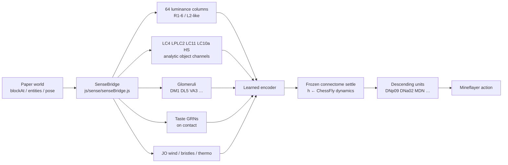
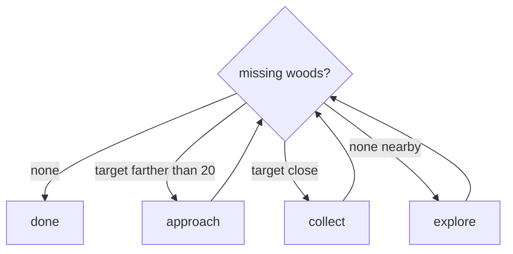

# Wood Collector Bot

A Minecraft bot whose purpose is to find and collect every type of wood in the overworld.

## Fruit-fly connectome policy

Mineflayer body + ChessFly-style frozen connectome. Minecraft is **not** fed to the fly as pixels, item IDs, or a “wood enum.” The live world is sampled and rewritten into the same named *Drosophila* sensory populations a real fly already has (photoreceptors, glomeruli, GRNs, LC/HS object cells, Johnston’s organ, bristles). Goals are extra drive on that same frame. Rarest-log collection is an outer loop only (census → pick a GoalSpec). Provenance of each table: [docs/SENSE_PROVENANCE.md](docs/SENSE_PROVENANCE.md). Contract: [AGENTS.md](AGENTS.md).

### How the world becomes something the fly can natively understand

A fruit fly does not see a 2K RGB screenshot. Its native visual language is **retinotopic luminance + a few optic-lobe feature detectors** (loom, small movers, yaw flow). Smell is **glomeruli**, not “oak_log.” Taste is **gustatory receptor neurons** on contact. We therefore take the *actual* Paper world FruitFly is standing in (`bot.blockAt`, `bot.entities`, inventory/contact) and compile it into a `SensoryFrame` that matches [fly-brain-minecraft](https://github.com/blendi-remade/fly-brain-minecraft) (`SensoryFrame` / `WorldSenses` / `SensoryEncoders`).

The RGB first-person grid on the dashboard is **for us**: the same world, from the fly’s eyes, so we can see what it would have seen. The fly still only gets the luminance / LC channels below.



**Principle:** map *world physics* onto *fly physics*. Never invent a “chicken neuron” or a “wood neuron.” A chicken is a nearby entity with size and motion → it can raise `LC11` (small mover). Oak is a block class with a green-leaf odor row → it raises `DL5` / `DM1` / `VA3`. The connectome only ever sees those fly names.

#### 1. Visual cortex — the world image, in fly coordinates

The policy does **not** receive an RGB frame. It receives **64 columns of luminance** (32 left eye, 32 right), which is the closest we can get to lamina photoreceptor rates without claiming a camera.

| Step | What happens | Why a fly would understand it |
|---|---|---|
| Sample the real world | `sampleBot` reads solid blocks in an 8-block radius via Mineflayer `blockAt` (loaded chunks only — no map cheat) | Same constraint as a compound eye: only what is in front / nearby |
| Cast fly rays | `retina.json`: azimuth **−150°…+150°**, elevation **−40°…+50°**, max **24** blocks, L then R. Head frame: azimuth 0 = ahead, **+ = fly’s right** | Matches fly-brain-minecraft `RetinaGeometry`, not a Minecraft FOV camera |
| Hit → luminance | `light/15 × dayFactor × (0.3 + 0.7 × albedo)` | Photoreceptors report intensity, not block IDs. Albedo is a coarse reflectance (log dark, snow bright, leaves darker than grass) |
| Miss → sky/ground | Sky-ish if the ray points up (`wy > −0.2`), dimmer if it points down | Empty space is still a luminance, as in a real retina |
| Nearby mobs darken overlapping columns | If an entity subtends ≥2°, those rays are pulled down by contrast | Objects occlude the retina; they are not labeled “sheep” in the vector |

Config: [`configs/sense/retina.json`](configs/sense/retina.json). Code: [`js/sense/senseBridge.js`](js/sense/senseBridge.js) `sampleWorld` / `sampleBot`.

That 64-vector is what the encoder actually sees.

The dashboard RGB / 2K POV is the same `blockAt` world, cast as a denser color ray grid and upscaled for humans. It answers “what would FruitFly have seen just now?” It is **not** an extra input. If the RGB view shows a tree slightly left of center, that is the world those 64 luminance columns were sampled from.

#### 2. Optic-lobe object channels — motion, not mob names

Entities from `bot.entities` become anonymous blobs: azimuth, elevation, angular size, expansion, speed. Those numbers drive real LC / HS populations (same names as male-cns / fly-brain-minecraft Neuroscope):

| Channel | Minecraft event | Fly meaning |
|---|---|---|
| `LC4` | Angular size growing (something approaching) | Loom / expansion |
| `LPLC2` | Blob whose size is near ~60° | Classic looming disk |
| `LC11` / `LC18` | Small (`<15°`) and moving (`>5°/s`) | Small-object motion (chickens, sheep, items) |
| `LC10a` | `flyLike` (player / “fly”) in the front 40° | Courtship / fly-sized frontal target |
| `LC15` | Large blob near the horizon | Large object in front |
| `HS` | FruitFly’s own yaw rate | Horizontal system / ego-rotation |

Hill law (same as fly-brain-minecraft): \(r \propto S^{1.5}/(0.2^{1.5}+S^{1.5})\). A chicken can light `LC11`. It cannot light a chicken unit — there isn’t one.

#### 3. Olfaction — blocks and mobs as glomeruli

Smell is **not** “detect oak.” Each block / item / entity class is a row of affinities onto named glomeruli, then a plume:

\[
c = e^{-d/\lambda},\quad \lambda = 6\ \text{blocks}
\]

Left/right bearing is computed from the concentration-weighted source vector (`odorBearingDeg`, **+ = fly’s right**), packed as `sin` / `cos` into the observation.

Woods are ordinary rows in [`configs/sense/block_odor.json`](configs/sense/block_odor.json) (green-leaf / terpene-ish glomeruli), for example:

| World thing | Glomeruli (weights) | Native reading |
|---|---|---|
| `oak_log` | DM1 0.4, DL5 0.7, VA3 0.4 | Leaf-green / plant volatiles |
| `spruce_log` | DM1, DL5, DC2 | Similar plant, more terpene-ish |
| `cherry_log` / leaves | VL2a, D, VA6, DM1 | Floral / fruit-leaning |
| `oak_leaves` | DL5, VA3, D | Same plant channel as the log, stronger leaf |
| `water` / ice / snow | VP3a, VP3b, VP5 | Hygro / cold-adjacent |
| `lava` / fire / torch | VP2, V, VC2, VP4 | Heat / CO₂-like / smoke |
| `cake` / honey / berries | VA2, DP1l, DM1, VL2a | Food odor |
| creeper (entity table) | DA2, V, VC5 | Threat / CO₂-like — **not** a “creeper cell” |
| player | V, VM1 | CO₂ / social |

Entity table: [`configs/sense/entity_odor.json`](configs/sense/entity_odor.json). Chicken, donkey, sheep have **no** odor row today — they are vision-only (LC channels). That is intentional: we do not invent glomeruli for unmapped mobs.

#### 4. Taste — contact only

A fly tastes with tarsi and labellum when it touches something. We do the same: `standingOn` / water / held item if the “proboscis” is out → [`configs/sense/taste_table.json`](configs/sense/taste_table.json) → GRNs (`LB3b` sugar, `LB1a` bitter, `LgLG3` tarsal sweet, …). Walking past a cake does nothing. Standing on it or dunking in water does.

#### 5. Mechanosensation, wind, thermo

From pose and world flags, not from a HUD:

- **Johnston’s organ wind** — airspeed from horizontal velocity, split L/R by sideslip ([`configs/sense/mechano.json`](configs/sense/mechano.json))
- **Bristles** — horizontal collision → `touchHead` / `touchLegs`
- **Rain / water** — `groomDust`, `moist`, wet tarsi
- **Thermo-hygro** — biome temperature vs thresholds → `hot` / `cold` / `dry` (VP2 / VP3 / VP4 / VP5 identities)
- **Proprio** — `airborne`, `legsOnGround`, `wingbeat`, yaw/pitch rate

#### 6. Goals are more smell / more loom — not a new input type

A `GoalSpec` (`configs/goals/*.json`) only **adds** current to the same `SensoryFrame`. Example `collect:oak_log`: tonic extra `DM1/DL5/VA3` (search odor) + extra `LC11` when an oak log is actually in view. The fly never receives the string `oak_log`. Rarest-log logic lives **outside** GoalToSense (census → pick an existing spec).

#### 7. What the connectome actually consumes

[`python/sense/frame.py`](python/sense/frame.py) `frame_to_vector` packs, in order:

1. 64 retina luminances  
2. 32 glomeruli + 2 bearing (sin, cos)  
3. 19 GRNs  
4. 7 object channels (`LC4` … `HS`)  
5. 21 mechano / thermo flags  
6. yaw rate / 180, pitch rate / 90  

That vector is encoded onto **named sensory units** in the mini male-cns (`ORN_DL5`, `R1-6`, `LC4`, `JO-C`, …). Frozen ChessFly dynamics settle for 5 steps; a decoder reads **descending neurons** (`DNp09` forward, `DNa02_L/R` turn, `MDN` back, `DNp01` escape, …) into Mineflayer actions.

The running graph is the documented prune (`data/connectome/mini_male_cns.npz`, 63 units, 233 edges, real names). The full ~176k male-cns is **not** vendored and is **not** what is being activated live. Dashboard “Neuroscope” shows this live graph, in the style of fly-brain-minecraft’s HUD — not a fake 170k spike raster.

#### 8. What we deliberately do *not* send

- RGB / GPU frames, screenshots, or prismarine-viewer pixels into the encoder  
- Block IDs, entity type strings, inventory counts, or “rarest wood” as features  
- A 64×64 camera (the fly retina here is **64 columns**, two eyes). A 64×64 az/el map, if shown, is display-only  
- Invented units (“chicken”, “oak”, “diamond”)  

If a world fact cannot be expressed as luminance, a glomerulus, a GRN, an LC/HS channel, or a JO/bristle/thermo rate, it does not enter the brain.

Put `WANDB_API_KEY=` in **`.env`** (see `.env.example`). Do not commit it.

```bash
./start-server.sh   # Paper 1.21.11, localhost:25565 only
uv sync --group dev
npm install
npm test
uv run pytest
uv run python python/train.py configs/train/rarest_minecraft.yaml
```

`train.py` joins as **FruitFly**, PPO-finetunes `checkpoints/fly_mc_ppo.pt` on the live world (only the current rarest log pays), and writes `checkpoints/fly_mc_rarest.pt`.

**Live HTML board (open while `train.py` is running):**

**http://127.0.0.1:8766/**

Left: current SensoryFrame / rarest census / action. Right: RGB of what FruitFly would have seen (same world rays; the fly still only gets the 64-col retina). W&B: project `fly-mc`. TLauncher: `127.0.0.1:25565`.

```bash
node fly.js                               # explore / chat: stop | explore | log
uv run python python/train_il.py          # synthetic IL → checkpoints/fly_mc.pt
uv run python python/train_rl.py          # synthetic oak PPO → fly_mc_ppo.pt
uv run python python/eval_harness.py
uv run python python/infer_server.py      # TCP 8765
```

In game (`node bot.js`): `sense`, `goal collect_oak`, `log`, `fly` (needs infer_server), `go` (legacy lumberjack expert).

---

I made this to get a hang of game logic fundamentals and scripting using mineflayer.

## Abstract

- Problem: nine overworld log types spawn in different biomes. Chopping the oak next to spawn does not finish the job.
- Approach: a checklist loop. Missing woods → approach if the log is far, collect if it is close, otherwise hop-explore. Repeat until the list is empty.
- What broke: pathfinder “success” while jammed in a corner; walking 100 blocks into water; retargeting the same tree; staring at a log instead of mining it.
- Current status: [`bot.js`](bot.js) is the body (connect, walk, mine, chat `go`). [`brain.js`](brain.js) is the brain: checklist, approach vs collect, hops, oscillation abort, tree blacklist, hole-escape. `node bot.js` loads both.

## Problem

The goal is one log of each of nine types: oak, spruce, birch, jungle, acacia, dark oak, mangrove, cherry, pale oak. No nether stems.

- Why a farm bot is the wrong design: a farm sits in a fence, waits, and replants. I need the bot to leave after each type and find a new biome.
- Constraint — Mineflayer is a fake player, not an omniscient agent: it sees loaded chunks, walks with pathfinder, and dies in survival. It does not get a map of every tree.
- Constraint — local Paper server: Java 1.21.11 on `localhost:25565`. I watch from TLauncher. The bot is survival, op’d once so it can `/give` itself an axe.

## System

[`bot.js`](bot.js) is the body: connect, walk, mine, chat. [`brain.js`](brain.js) is the brain: what to do next.



Each loop tick also asks `mapLocal` if it is in a 1-block pit, and `path_update` aborts if `isOscillating` trips.

Constants worth naming:

- Trail length: 20 last positions (LIFO backtrack when a hop fails)
- Explore hops: 12–20 blocks, eight scored landings, snapped to standable ground
- Blacklist box: ±3 X/Z, ±6 Y around a failed or finished tree
- Other: search 64 blocks, up to 10 candidates; `nextAction` treats distance >20 as approach, not collect

## Iteration log

### Attempt 1: random 100-block wander

- Seen: no matching log nearby, so pick a random angle and `GoalXZ` 100 blocks out. Pathfinder aborted over water and cliffs; the bot froze until the next loop.
- Hypothesis: a far XZ goal is a destination, not a plan. Terrain in between is the actual problem.
- Change: shorter explore targets, then a queue of them instead of one giant leap.
- Result: better
- Keep or drop: dropped the 100-block shot. Kept “if nothing nearby, walk somewhere new.”

### Attempt 2: tree-farm example

- Seen: I pasted a collectblock tree-farm sample. It waited on hardcoded farm coords and tried to replant. Copy errors too (`newBlock` / `pos` that did not exist).
- Hypothesis: sitting still is the opposite of hunting biomes.
- Change: threw it out. Built a `while` loop around a missing-woods checklist instead.
- Result: better
- Keep or drop: dropped the farm. Kept collectblock for the actual chop-and-pickup, and the checklist as the whole design.

### Attempt 3: corner “success”

- Seen: terminal said `path: success` and a short move count while the bot was wedged in a corner, not making progress.
- Hypothesis: pathfinder success means it computed or finished a path, not that the bot is usefully unstuck.
- Change: started logging path length, and treated “success but not moving” as a stuck case I had to detect myself.
- Result: better as a diagnosis, not a fix by itself
- Keep or drop: kept the logs. The real fix is attempt 4.

### Attempt 4: 7↔8 oscillation

- Seen: path lengths flipping 7, 8, 7, 8… bouncing between two spots. A path of `2, 2, 2…` looked similar in the log but was a short real walk.
- Hypothesis: exactly two distinct recent lengths is a wedge. One repeating length is often fine.
- Change: `isOscillating` — last 6+ lengths, `Set` size === 2. Do not treat a constant short path as stuck.
- Result: better
- Keep or drop: kept. `path_update` pushes recent lengths; if it trips, `bot.pathfinder.stop()` aborts the current path.

### Attempt 5: FIFO frontier + LIFO trail

- Seen: one random explore goal, fail, pick another random goal, often next to the failed one. No memory of where it had been.
- Hypothesis: a queue of places to try (FIFO) plus breadcrumbs to undo (LIFO) is enough scratchpad without a full map.
- Change: first a FIFO frontier at 40–80 blocks plus a 20-long trail; later the frontier lost to scored hops (12–20). Trail stays for undo.
- Result: better on open ground
- Keep or drop: dropped the 40–80 queue. Kept LIFO trail; explore is `pickExploreGoal`, then `backtrack()` if the hop fails.

### Attempt 6: tree blacklist

- Seen: collect threw (unreachable, or already chopped). Next loop picked the same trunk again.
- Hypothesis: blacklisting one block is too small — the rest of the tree is still “nearest missing log.”
- Change: `blacklistTree` marks a 7×13×7 box. `nearestUnblacklisted` picks among up to 10 `findBlocks` hits.
- Result: better
- Keep or drop: kept the box. After a collect (success or fail) that tree is done.

### Attempt 7: stare, don’t mine

- Seen: bot faced an oak with a clear path and did not swing. Other runs: broke the log, then stared at the item drop instead of walking onto it. Sometimes walked the opposite way from the closest tree.
- Hypothesis: “there is a target” is not one action. Far away needs walk; close needs collect; collectblock’s path and pickup are easy to desync. Nearest-in-list is not always nearest-in-world if you skip badly.
- Change: `nextAction` splits approach (>20 blocks, `GoalNear`) vs collect (`collectBlock.collect`).
- Result: mixed
- Keep or drop: kept the split; the live loop uses it. Pickup after chop is still flaky.

### Attempt 8: holes / ravines

- Seen: 1-block pits, ravine lips, mountain steps. Pathfinder stalled or the bot fell and sat there processing.
- Hypothesis: before a long path, look at N/E/S/W: walkable, step-up, or solid. If boxed, climb a rim — dirt, not the log. Explore hops should land on standable ground and not jump more than 6 Y.
- Change: `mapLocal`, `bestStepUp`, `pickExploreGoal` / `scoreHop` (reject recent landings, penalize tight clearance).
- Result: better in a hole, still weak on ravines and mountains
- Keep or drop: kept. Each loop tick runs `mapLocal` / `bestStepUp` before walking. Cobble on spawn was for bridging; I never really used it as a planner.

## Decision logic

- Checklist — `missingWoodTypes`: done means every `*_log` is in inventory, not “I chopped something once.”
- Action — `nextAction`: empty list → done; target past 20 blocks → walk; target close → collect; no target → explore.
- Stuck — `isOscillating`: 7↔8 is a wedge; 2,2,2 is usually a real short path.
- Memory — trail, `blacklistTree`: stack for undo, a box so a failed tree stays failed. Hops replace the old frontier queue.
- Hops — `pickExploreGoal` / `scoreHop`: eight candidate landings, 12–20 out, snapped to a standable surface; reward closing on a target, punish height and tight gaps.
- Pits — `mapLocal` / `bestStepUp`: four neighbors at feet/head; step up the rim that faces the goal, prefer not climbing the log.

## How to run

```bash
./start-server.sh
node bot.js
```

In chat: `go`

Needs Minecraft 1.21.11 against the local Paper server. `Lumberjack` should be op once so the spawn kit (`/give` axe and cobble, `/setblock` chest) works.

## Limits

What still fails:

1. Ravines and steep terrain still stump the bot. A 12–20 hop is not a mountain path.
2. Collect is inconsistent: looks at the tree, skips pickup, or walks off the closest log.
3. Hole-escape is a one-block step-up. A real ravine still needs a different plan.

What I would do next:

1. After a break, walk onto the drop (or a `GoalNear` the item) before picking the next tree.
2. Feed a real clearance scan into `pickExploreGoal` instead of the default.
3. Use the cobble kit to bridge when `mapLocal` says boxed with no step-up.
